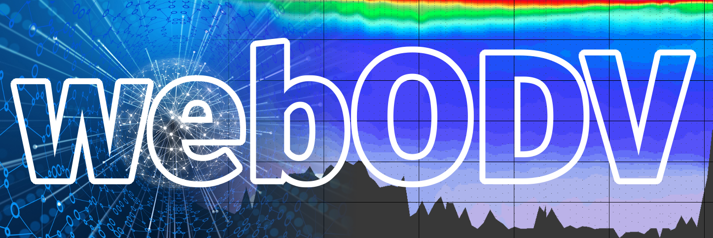
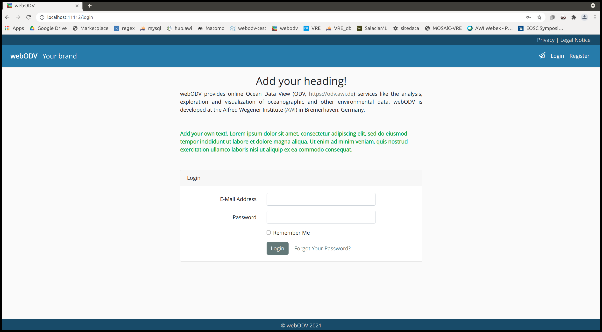

# webODV

A powerful tool for interactive online data exploration, analysis, visualization and more



## Productive webODV Instances:

#### [https://geotraces.webodv.awi.de](https://geotraces.webodv.awi.de)

#### [https://emodnet-chemistry.webodv.awi.de](https://emodnet-chemistry.webodv.awi.de)

#### [https://explore.webodv.awi.de](https://explore.webodv.awi.de)

## Features

- Set up your own **webODV** instance
- Wrapped in a Docker container
- Comes with a docker-compose.yml
- Customize to your own needs
- SSL support
- Secure registration and login
- Usermanagement based on Laravel
- Include your own data

## Dependencies

- Docker
- Docker Compose

## Getting started

Clone or download the webodv repository to your computer. Make sure to
have Docker and Docker Compose installed and that you have the
permissions to execute docker. Additionally you will need
a text editor and
having access to the shell via a terminal. We are working in a
Linux environment, however thanks to the Docker abstraction other
environments could work as well.

## Setup

First we start with setting up a local "default" **webODV** instance,
which is straight forward. For customizing and setting up an
operational instance at a public URL you have to edit a couple of
files, which will be explained later.

### Download ODV.zip

First, download *ODV.zip* at [https://drive.google.com/file/d/1pUf_FxNbNWQGvxdT3fUvWpCmLQC9tXme/view?usp=sharing](https://drive.google.com/file/d/1pUf_FxNbNWQGvxdT3fUvWpCmLQC9tXme/view?usp=sharing) and extract it. Make sure that a user with uid=1000 has read/write access:

``` shell
sudo chgrp -R 1000 ODV
sudo chmod -R 775 ODV
```

### Docker build

To build the Docker image we simply open a terminal and type:

``` shell
docker build -t hub.awi.de/webodv/webodv:v1.0.0 .
```

We are using the image name, that is used in the *docker-compose.yml*.

### docker-compose up

Now that we have build the docker image, we can start **webODV** by typing

``` shell
docker-compose up
```

You can stop it by hitting CTRL-C, or you can run it in the background with

``` shell
docker-compose up -d
```

To stop it again type:

``` shell
docker-compose down
```

Congrats ! You have a fully working default version at
*http://localhost:11112*, which looks like



You can now register / login and use the included example dataset with **webODV**.

## Settings

Now let's have a look into some files to understand how to customize
**webODV** and how to finally deploy it on a public URL.

### docker-compose.yml

Let's look into the *docker-compose.yml*. The first block is the user
database:

``` yaml
  db:
   image: mysql/mysql-server:8.0.0
   environment:
    MYSQL_ROOT_PASSWORD: "root"
    MYSQL_DATABASE: webodv
    MYSQL_USER: webodv
    MYSQL_PASSWORD: webodv
   networks:
    - webodv-dev
   ports:
    - 3307:3306
   #make db permanent
   #volumes:
    #- ./db:/var/lib/mysql
```

Since the database is running securely inside the Docker container we
use simple passwords. If you change user or passwords here you have to
adapt later the file *OverWrites/PKTenv*. You can have the database
permanently saved on disk if you uncomment

``` yaml
   #make db permanent
   volumes:
    - ./db:/var/lib/mysql
```

Now the database is stored in the folder *db*. 

As you can see we have a **phpmyadmin** running on port 11111

``` yaml
  phpmyadmin_db:
   image: phpmyadmin/phpmyadmin
   depends_on:
    - db
   ports:
    - 11111:80
   networks:
    - webodv-dev
   environment:
     PMA_HOST: db
     PMA_PORT: 3306
```

for easy accessing the user database.  
Next we have the **webODV** app, where you can name the image as you
like, but keep in mind to build the image with that name.

``` yaml
  webodv:
   image: hub.awi.de/webodv/webodv:v1.0.0
   depends_on:
    - dbodv
    - db
   ports:
    - 11112:80
   networks:
    - webodv-dev
```

Now we are coming to the volumes, which are mounted files and folders
from the current directory:

``` yaml
   volumes:
    # ODV installation
    - ./odv_software:/var/www/html/bin:ro
    # ODV bathy data
    - ./ODV:/home/woody/Documents/ODV:rw
    # data
    - ./ODV_Data:/var/www/html/webodv/storage/app/default:rw
    #- settings
    - ./settings:/var/www/html/webodv/storage/app/settings/settings_webodv:rw
    # init
    - ./init.bash:/var/www/html/init.bash
    #
    # development: "xhost +" to tunnel X11 apps 
    #- ./webodv:/var/www/html/webodv:rw
    #- /home/smieruch/.Xauthority:/root/.Xauthority
    #- /tmp/.X11-unix:/tmp/.X11-unix
```

- odv_software: This is the folder which contains the **wsodv** executable software.
- ODV: This folder contains ODV map, borders, bathymetry etc. files.
- **ODV_Data**: This is the folder, which contains your ODV
  collections. Keep in mind that an ODV collection consists of a .odv
  file and a .Data folder. Thus copy all your ODV collections into
  that folder. You can use as many subfolders as you want.
- settings: This folder contains specific setting files, which we will adapt later.
- init.bash: This file is needed for running the **webODV** Docker container.
- Finally we have three volumes for development purposes, which we do not need here.

The next block is the environment:

``` yaml
   environment:
    settings_name: default #
    settings_path: /var/www/html/webodv/storage/app/settings
    path_to_odv_settings: settings_webodv
    proxy_ws: webodv_ProxyPass.txt
    REVERSE_PROXY: 0   #o or 1 for false and true
    FORCE_SCHEME: http        #see AppServiceProvider
    FORCE_ROOT_URL: https://dev.webodv.awi.de
```

In the case we want to provide **webODV** via SSL and a public URL, we
have to adapt some settings here, which will be discussed later.

Now it's time to customize **webODV** to your project or application.

### OverWrites

The idea of customizing is that we have this folder *OverWrites*,
which contains a couple of files, which we can edit to adapt
**webODV** to our needs. To avoid that your custom files will be
overwritten or changed during a next update (git pull etc.) you have first to copy the
folder *OverWrites* to a custom folder: 

``` shell
cp -r OverWrites MyOverWrites
```

We start now editing the files in *MyOverWrites* and then copy them
into *webodv*. Finally we have to rebuild the **webODV** image.

#### my_impressum.html

For an operational implementation of **webODV** it is crucial to add
your own "Legal Notice", therefore you have to adapt *my_impressum.html*.

### my_privacy.html

The same is true for the "Privacy", thus adapt *my_privacy.html*.

### my_PKTenv

This is an important file, which controls your **webODV** app. Let's
have a look at some of the included blocks:  
First we see that the app is running in production mode, because
"APP_DEBUG" is set to *false*:

``` text
APP_NAME=webODV
APP_ENV=local
APP_KEY=base64:vLeTMl/dO8M6tVbamNdXQP/Cm2if4058V9M844BR+2c=
APP_DEBUG=false
APP_URL=http://localhost
```

This means that any errors, which hopefully do not occur, will not be
propagated to the users browsers. Set it to *true* to get more
information in the case of an error.

Then we have the block with the database:

``` text
DB_CONNECTION=mysql
DB_HOST=db
DB_PORT=3306
DB_DATABASE=webodv
DB_USERNAME=webodv
DB_PASSWORD=webodv
```

Use here the username and password, which is used in the
*docker-compose.yml*.

The next block is important for the *session* and for *cookies*.

``` text
BROADCAST_DRIVER=log
CACHE_DRIVER=file
QUEUE_CONNECTION=database
SESSION_DRIVER=database
SESSION_LIFETIME=120
#SESSION_DOMAIN=".webodv.awi.de"
SESSION_NAME=webodv
SESSION_SECURE_COOKIE=true
```

Here you can uncomment the "SESSION_DOMAIN" and adapt it to your
domain so that the cookies are only valid for that domain. Use a "."
as a wildcard for subdomains. Additionally you can set the session
lifetime and name.

The next important block is the "Mail"-block:

``` text
MAIL_DRIVER=smtp
MAIL_HOST=smtp.awi.de
MAIL_PORT=587
MAIL_USERNAME=XXXXXXXX
MAIL_PASSWORD=XXXXXXXX
MAIL_ENCRYPTION=TLS
MAIL_FROM_ADDRESS=sebastian.mieruch@awi.de
MAIL_FROM_NAME="webODV"
```

Include here your personal mail information including username and
password to enable sending emails.

### my_webodv_settings_default.json

We continue with a settings file, where for now, as long as we are
running a local instance, we have to set only a single parameter, which is

``` json
    "direct_downloads": true
```

which we can set to *true* or *false*. If it's true, the **webODV**
data extractor will directly provide the zipped downloads to the user
via the browser. If it's set to *false*, the download will be
processed in the background and as soon as it's finished, the user
will be informed by email. **Attention**: this works only, if the
"Mail" functions (see above) are correctly implemented.

### my_webodv.php

Another settings file has to be adapted now. For now 6 parameters
have to be adapted:

``` php
    'copyrights' => 'webODV 2021',
    'brand' => 'Your brand',
    'index_heading' => 'Add your heading!',
    'index_add_text' => '<div class="text-success"><b>Add your own text!. Lorem ipsum dolor sit amet, consectetur adipiscing elit, sed do eiusmod tempor incididunt ut labore et dolore magna aliqua. Ut enim ad minim veniam, quis nostrud exercitation ullamco laboris nisi ut aliquip ex ea commodo consequat.</b></div>',
    'login_add_text' => '<div class="text-success"><b>Add your own text!. Lorem ipsum dolor sit amet, consectetur adipiscing elit, sed do eiusmod tempor incididunt ut labore et dolore magna aliqua. Ut enim ad minim veniam, quis nostrud exercitation ullamco laboris nisi ut aliquip ex ea commodo consequat.</b></div>',
    'cookie_text' => 'We use cookies to ensure that we give you the best experience on our website. Additionally we use the web analytics software <i>Matomo</i> to monitor page usage. If you continue to use this site we will assume that you are happy with it.'
```

which are the "copyrights" text at the bottom of the page, the
"brand", the "heading", additional texts and the text for the
"cookie"-popup.

### overwrites.bash

Finally execute *overwrites.bash*:

``` shell
./overwrites.bash
```

to overwrite the default files with your personal settings.

### Restart

Stop docker, build the Docker image and run it again.

``` shell
docker-compose down
docker build -t hub.awi.de/webodv/webodv:v1.0.0 .
docker-compose up -d
```

Congrats again ! You have your own customized **webODV** running.


## Operational setup

If you want to implement **webODV** on a public URL, you need access
to a server, which is connected to the www via a registered URL. Here
we will implement the productive **webODV** on our own machine with an
installed Apache server. We will run the Apache as a proxy server,
generate ssl keys and we will make an entry into the */etc/hosts*
file. This approach is a template for you to setup **webODV**
operationally on your environment.

## ssl certificates

For our local productive system we need ssl certificates, which we
will generate using **mkcert** ([https://github.com/FiloSottile/mkcert](https://github.com/FiloSottile/mkcert)). 

``` shell
mkcert "*.webodv.de"
```

which will generate the files *_wildcard.webodv.de-key.pem* and
*_wildcard.webodv.de.pem*. Copy the files into */etc/certs* (root
permissions needed). These certificates are now valid for all
subdomains ending with ".webodv.de".

## proxy config

Copy the *webodv_proxy.conf* to */etc/apache2/sites-available* (root
permissions needed). As you can see in this file, the "ServerName" is
"dev.webodv.de", thus the above certificates are valid. Further down
in this file the certificates are loaded and a "ProxyPass" is
defined. This means that every http request, which arrives at
"dev.webodv.de" will be proxied to our **webODV** running on
"http://localhost:11112/". Similar the WebSocket request used in
**webODV** are proxied into the Docker container.

## my_webodv_settings_default.json

Now, let's go back to the *my_webodv_settings_default.json*. Now that
**webODV** is securely running via ssl, we have to set the parameter:

``` json
	"ssl_client": true,
```

to *true*.

## docker-compose.yml

Finally, we have to adapt the "environment" block in the *docker-compose.yml*:

``` yaml
   environment:
    settings_name: default #
    settings_path: /var/www/html/webodv/storage/app/settings
    path_to_odv_settings: settings_webodv
    proxy_ws: webodv_ProxyPass.txt
    REVERSE_PROXY: 1   #o or 1 for false and true
    FORCE_SCHEME: https        #see AppServiceProvider
    FORCE_ROOT_URL: https://dev.webodv.awi.de
```

We have to set "REVERSE_PROXY" to 1, "FORCE_SCHEME" to https and
"FORCE_ROOT_URL" to the respective URL.

## overwrites.bash

Again execute *overwrites.bash*:

``` shell
./overwrites.bash
```

to overwrite the default files with the new settings.

## Restart

Stop docker, build the Docker image and run it again.

``` shell
docker-compose down
docker build -t hub.awi.de/webodv/webodv:v1.0.0 .
docker-compose up -d
```

Go to https://dev.webodv.de.  
Now you have an operationl **webODV** running.

